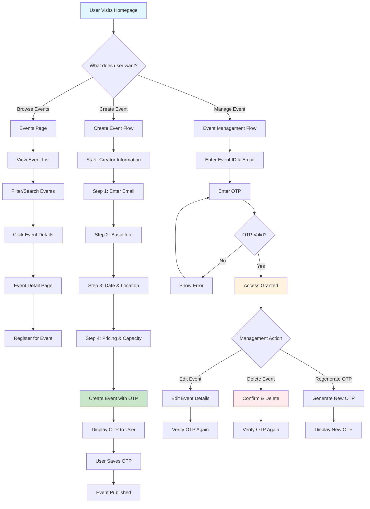
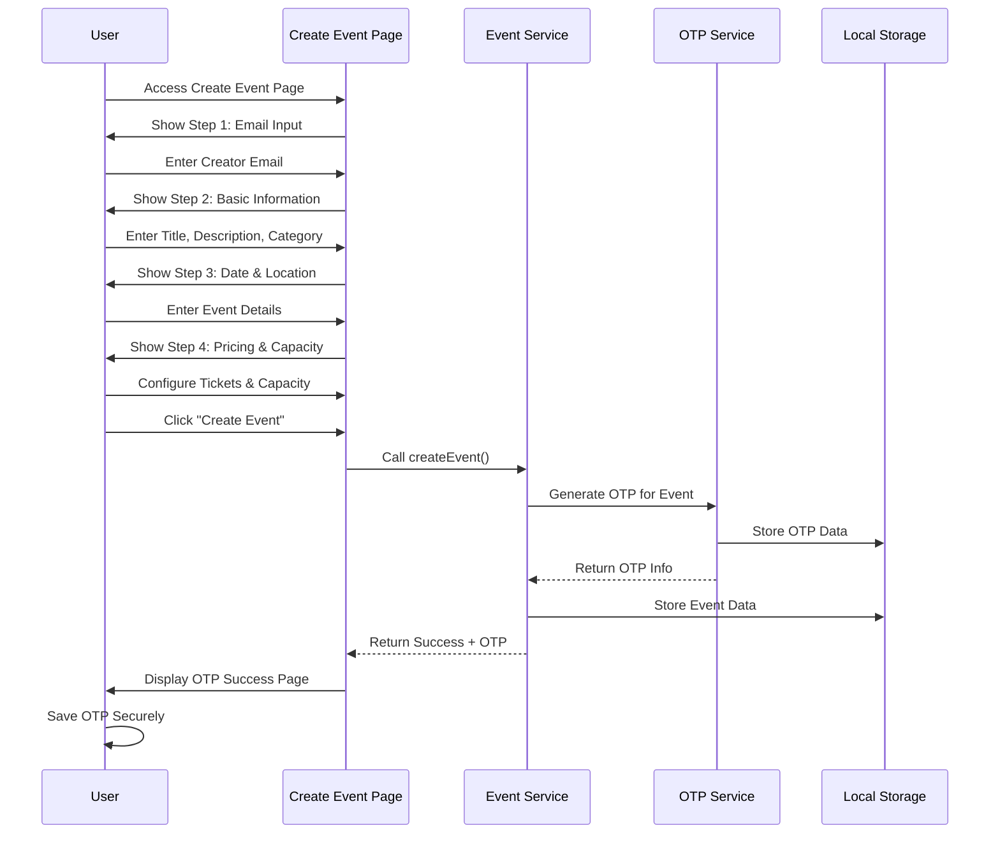
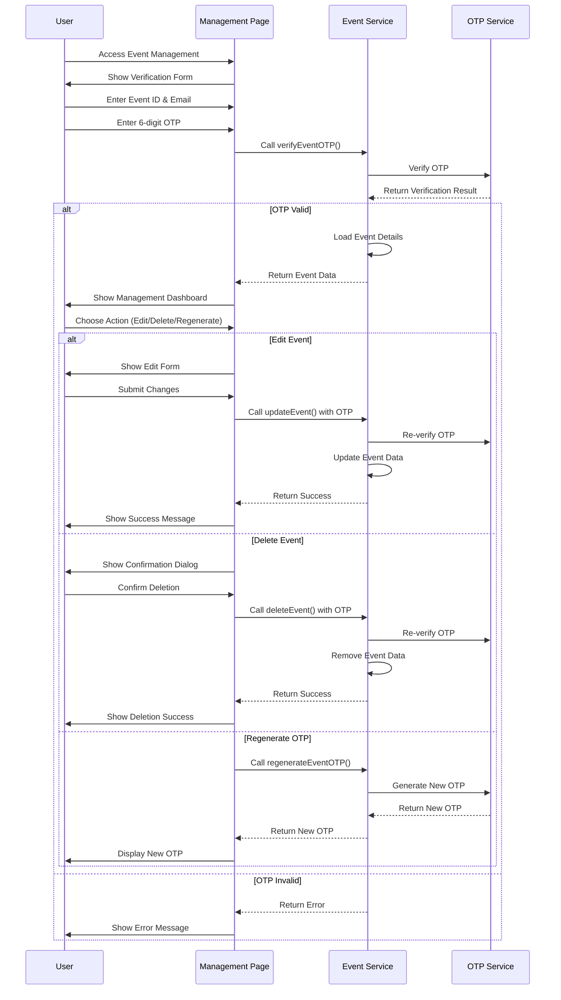
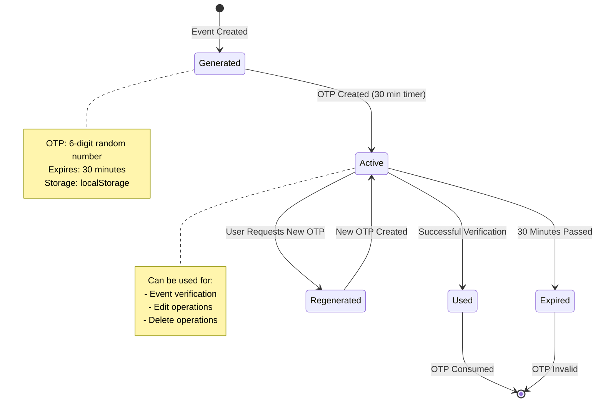
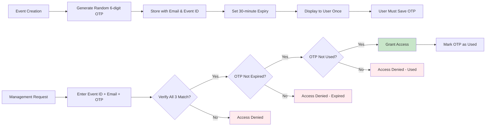
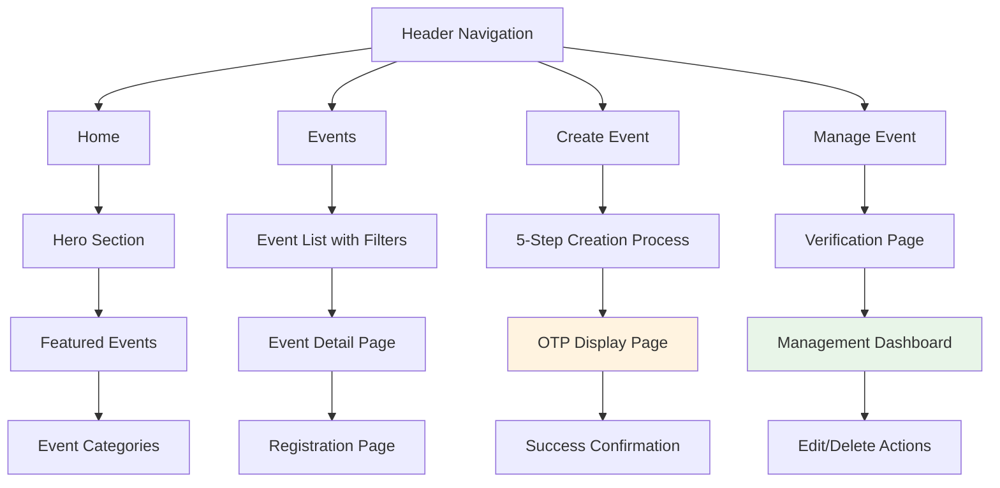
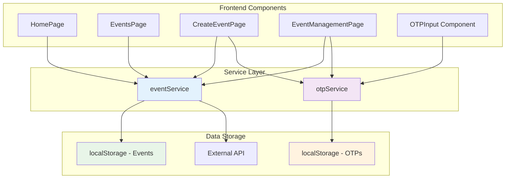
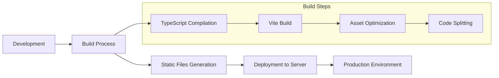
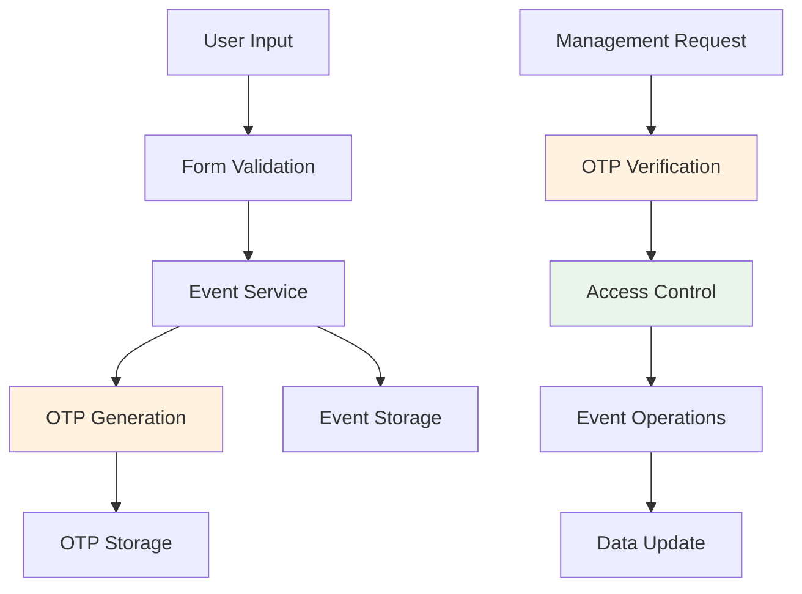
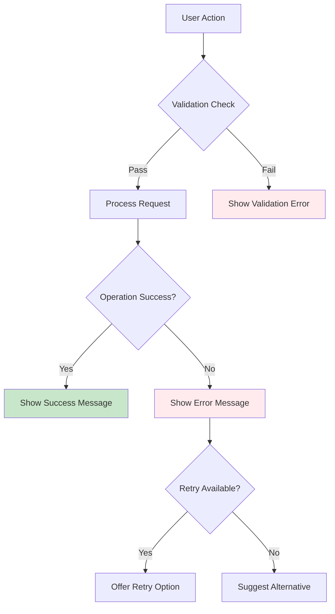

# Event Management System Workflow

## 📋 Complete Workflow Overview

This document outlines the complete workflow for the OTP-based event management system, showing how users can create, manage, edit, and delete events securely.

## 🔄 Main Workflow Diagram

## 🎯 Detailed Process Flows

### 1. Event Creation Workflow

### 2. Event Management Workflow

### 3. OTP Lifecycle Workflow

## 🔐 Security Workflow

### OTP Security Process

## 📱 User Interface Workflow

### Navigation Flow

## ⚙️ Technical Implementation Workflow

### Service Layer Architecture

## 🚀 Deployment Workflow

## 📊 Data Flow Workflow

### Event Data Management

## 🎯 User Journey Summary

1. **Discovery**: User browses events or wants to create one
2. **Creation**: User follows 5-step process with email verification
3. **Security**: System generates unique OTP for event management
4. **Storage**: User securely saves OTP for future use
5. **Management**: User can edit/delete events using OTP verification
6. **Lifecycle**: OTP expires in 30 minutes, can be regenerated

## 🔧 Error Handling Workflow

This comprehensive workflow documentation provides a complete overview of how the OTP-based event management system operates, from user interactions to technical implementation details.